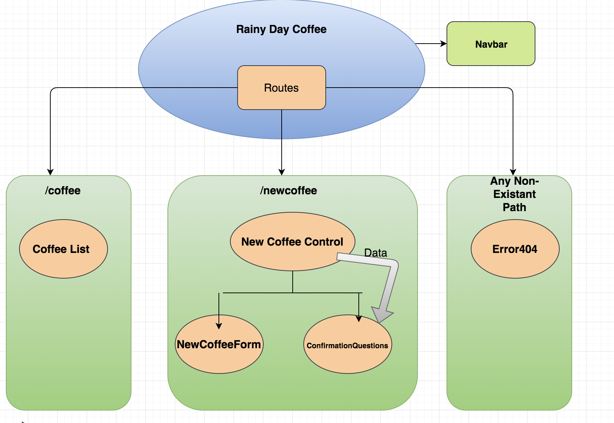

# Rainy Day Coffee -React
#### Epicodus Independent Project

### By Nanette Girzi

## Description
This webpage is a rebuild of an Angular Project for a coffee roasting store and cafe.

## Project Layout

## Setup
1. Clone this repository
2. type npm install in your terminal
3. After npm install is finished, type npm run start
4. navigate to http://localhost:8080/

## Known Bugs
Projecg layout shows image when doing a Readme preview, but not when committed to github

## Specifications
1. User can add coffee to the coffee list
2. User can navite between pages using the nav bar

## Items to be added
1. Add home page
2. Add about us page
3. Change the Add coffee page to an admin page with options to add create and delete
4. Add edit coffee feature
5. Add a coffee details page to view information on selected coffees
6. Add delete functionality
7. Add more styling

## Technologies Used
* Javascript
* JSX
* React
* CSS

## Legal
Copyright (c) 2018 Nanette Girzi
